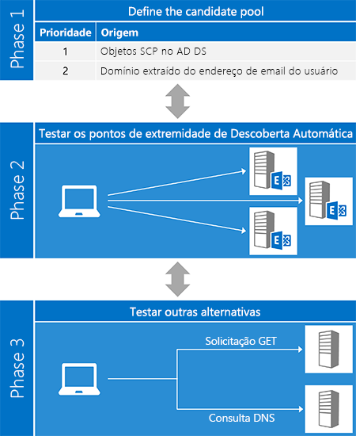
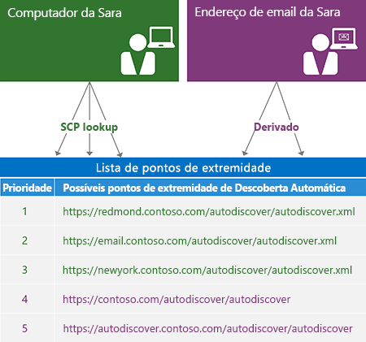
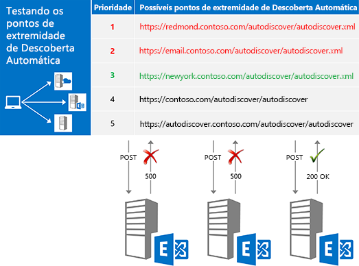

# Descoberta Automática do ExchangeAutodiscover for Exchange

Saiba mais sobre o serviço Descoberta Automática do Exchange.Learn about the Autodiscover service in Exchange.
  
O serviço Descoberta Automática do Exchange oferece uma maneira fácil de seu aplicativo cliente se configurar com entrada mínima do usuário. A maioria dos usuários sabe seu endereço de email e sua senha e, com esses dois tipos de informação, você pode recuperar todos os outros detalhes de que precisa para começar. Para clientes do Serviços Web do Exchange (EWS), Descoberta Automática é geralmente usada para localizar a URL de ponto de extremidade EWS, mas a Descoberta Automática também pode fornecer informações para configurar os clientes que usam outros protocolos. A Descoberta Automática funciona para aplicativos cliente dentro ou fora de firewalls e que funcionarão na floresta de recursos e em cenários de várias florestas.The Exchange Autodiscover service provides an easy way for your client application to configure itself with minimal user input. Most users know their email address and password, and with those two pieces of information, you can retrieve all the other details you need to get up and running. For Exchange Web Services (EWS) clients, Autodiscover is typically used to find the EWS endpoint URL, but Autodiscover can also provide information to configure clients that use other protocols. Autodiscover works for client applications that are inside or outside firewalls and will work in resource forest and multiple forest scenarios.
  
## Visão geral do processo de Descoberta AutomáticaOverview of the Autodiscover process

Essencialmente, o processo de Descoberta Automática tem três fases. Na fase 1, você gera uma lista de potenciais servidores de Descoberta Automática e, na fase dois, experimenta cada servidor em sua lista até obter uma resposta bem-sucedida. Se nenhum dos seus candidatos funcionar, passe para a fase 3, que representa uma "última tentativa" de localizar um ponto de extremidade de Descoberta Automática.The Autodiscover process essentially has three phases. In phase one, you generate a list of potential Autodiscover servers, and in phase two, you try each server in your list until you (hopefully) get a successful response. If none of your candidates worked out, you move on to phase three, which represents a "last ditch" attempt to find an Autodiscover endpoint.
  
O método [ExchangeService.AutodiscoverUrl](https://msdn.microsoft.com/library/microsoft.exchange.webservices.data.exchangeservice.autodiscoverurl%28v=exchg.80%29.aspx) da API gerenciada do EWS implementa todas as três fases desse processo e, portanto, se você estiver usando a API gerenciada do EWS, não precisará se preocupar em como implementar a Descoberta Automática. A figura a seguir mostra as três fases do processo de Descoberta Automática.The [ExchangeService.AutodiscoverUrl](https://msdn.microsoft.com/library/microsoft.exchange.webservices.data.exchangeservice.autodiscoverurl%28v=exchg.80%29.aspx) method in the EWS Managed API implements all three phases of this process for you, so if you are using the EWS Managed API, you don't need to worry about implementing Autodiscover yourself. The following figure shows the three phases of the Autodiscover process. 
  
**Figura 1. Três fases do processo de Descoberta Automática****Figure 1. Three phases of the Autodiscover process**

  
### Fase 1: Definindo o pool candidatoPhase 1: Defining the candidate pool

Antes de poder usar a Descoberta Automática, você precisa localizar o servidor de Descoberta Automática correto para o usuário. Felizmente, a Descoberta Automática define um número limitado de locais para procurar. No caso em que vários candidatos são encontrados, a Descoberta Automática também define [uma forma para gerar e priorizar a lista](how-to-generate-a-list-of-autodiscover-endpoints.md).Before you can use Autodiscover, you have to locate the right Autodiscover server for your user. Luckily, Autodiscover defines a limited number of places for you to look. In the case where multiple candidates are found, Autodiscover also defines [a way to generate and prioritize the list](how-to-generate-a-list-of-autodiscover-endpoints.md).
  
**Tabela 1: Fontes de candidatos a ponto de extremidade de Descoberta Automática****Table 1: Autodiscover endpoint candidate sources**

|**Local para pesquisar****Place to look**|**O que você encontrará****What you'll find**|
|:-----|:-----|
|Serviços de Domínio Active Directory (AD DS)Active Directory Domain Services (AD DS)    |Para clientes de domínio, é o primeiro local a ser pesquisado. O Exchange publica os objetos SCP (ponto de conexão de serviço) no AD DS, o que permite que as solicitações de Descoberta Automática sejam roteadas para servidores baseados em sites do Active Directory. Os resultados de uma [pesquisa de SCP](how-to-find-autodiscover-endpoints-by-using-scp-lookup-in-exchange.md) devem ficar na parte superior da sua lista de candidatos.  For domain-joined clients, this is the first place to look. Exchange publishes service connection point (SCP) objects in AD DS, which allows Autodiscover requests to be routed to servers based on Active Directory sites. The results of an [SCP lookup](how-to-find-autodiscover-endpoints-by-using-scp-lookup-in-exchange.md) should be at the top of your candidate list.    **OBSERVAÇÃO**: a pesquisa de SCP não está disponível para clientes que não fazem parte de um domínio ou que não têm acesso aos servidores do Active Directory.**NOTE**: SCP lookup isn't available for clients that are not joined to a domain or that do not have access to Active Directory servers. Nesse caso, você deve ignorar a pesquisa SCP.In this case, you should skip SCP lookup.  |
|O domínio de endereço de email do usuárioThe user's email address domain    | A Descoberta Automática define duas formas de URL padrão do ponto de extremidade derivadas da parte de domínio do endereço de email do usuário:Autodiscover defines two standard endpoint URL forms that are derived from the domain portion of the user's email address:   `"https://" + domain + "/autodiscover/autodiscover" +  *fileExtension*`   `"https://autodiscover." + domain + "/autodiscover/autodiscover" +  *fileExtension*`    O valor de  *extensãodeArquivo*  depende de qual método de acesso de Descoberta Automática você está usando, [SOAP ](https://msdn.microsoft.com/library/61c21ea9-7fea-4f56-8ada-bf80e1e6b074%28Office.15%29.aspx) ou [POX ](https://msdn.microsoft.com/library/877152f0-f4b1-4f63-b2ce-924f4bdf2d20%28Office.15%29.aspx). O serviço SOAP usa uma extensão de arquivo ".svc"; POX usa ".xml".  The value of  *fileExtension*  depends on which Autodiscover access method you are using, [SOAP](https://msdn.microsoft.com/library/61c21ea9-7fea-4f56-8ada-bf80e1e6b074%28Office.15%29.aspx) or [POX](https://msdn.microsoft.com/library/877152f0-f4b1-4f63-b2ce-924f4bdf2d20%28Office.15%29.aspx). The SOAP service uses a ".svc" file extension; POX uses ".xml".    |
   
A figura a seguir mostra como gerar uma lista de pontos de extremidade da Descoberta Automática.The following figure shows how to generate an Autodiscover endpoint list.
  
**Figura 2. Processo para gerar uma lista de pontos de extremidade da Descoberta Automática****Figure 2. Process for generating an Autodiscover endpoint list**

  
### Fase 2: Experimentando cada candidatoPhase 2: Trying each candidate

Depois de gerar uma lista ordenada de potenciais candidatos, a próxima etapa será experimentar cada um na lista ao [enviar uma solicitação para a URL](how-to-get-user-settings-from-exchange-by-using-autodiscover.md) e validar os resultados, como mostrado na Figura 3. Quando você receber uma resposta bem-sucedida, sua busca estará terminada.After you generate an ordered list of potential candidates, the next step is try each one in the list by [sending a request to the URL](how-to-get-user-settings-from-exchange-by-using-autodiscover.md) and validating the results, as shown in Figure 3. When you get a successful response, you're done! 
  
**Figura 3. Experimentando cada ponto de extremidade candidato em ordem****Figure 3. Trying each endpoint candidate in order**

  
Antes de enviar uma solicitação para um candidato, verifique se ele é confiável. Lembre-se de que você está enviando as credenciais do usuário e, portanto, é importante certificar-se de que você as esteja compartilhando apenas com um servidor em que pode confiar. No mínimo, deve-se verificar:Before you send a request to a candidate, make sure it is trustworthy. Remember that you're sending the user's credentials, so it's important to make sure that you're only sharing them with a server you can trust. At a minimum, you should verify:
  
- Se o ponto de extremidade é um ponto de extremidade HTTPS. Os aplicativos cliente não devem se autenticar ou enviar dados para um ponto de extremidade não SSL.That the endpoint is an HTTPS endpoint. Client applications should not authenticate or send data to a non-SSL endpoint.
    
- Se o certificado SSL apresentado pelo servidor é válido e de uma autoridade confiável.That the SSL certificate presented by the server is valid and from a trusted authority.
    
> [!NOTE]
> Esses são apenas sugestões básicas de segurança. Sempre que você estiver trabalhando com autenticação, certifique-se de que seu código atenda aos requisitos de segurança da sua organização.These are just basic security suggestions. Whenever you are working with authentication, make sure that your code meets the security requirements of your organization. 
  
O tipo de solicitação enviada depende de como você está acessando o serviço Descoberta Automática.The type of request you send depends on how you are accessing the Autodiscover service.
  
**Tabela 2. Tipos de solicitações de Descoberta Automática****Table 2. Types of Autodiscover requests**

|**Se você estiver usando...****If you are using…**|**Envie uma solicitação usando...****Send a request by using…**|
|:-----|:-----|
|A API gerenciada do EWSThe EWS Managed API    |O método [GetUserSettings](https://msdn.microsoft.com/library/microsoft.exchange.webservices.autodiscover.autodiscoverservice.getusersettings%28v=exchg.80%29.aspx).The [GetUserSettings](https://msdn.microsoft.com/library/microsoft.exchange.webservices.autodiscover.autodiscoverservice.getusersettings%28v=exchg.80%29.aspx) method.    |
|O serviço Descoberta Automática SOAPThe SOAP Autodiscover service    |A operação [GetUserSettings](https://msdn.microsoft.com/library/758d965c-ef63-4de4-9120-e293abf14ff8%28Office.15%29.aspx).The [GetUserSettings](https://msdn.microsoft.com/library/758d965c-ef63-4de4-9120-e293abf14ff8%28Office.15%29.aspx) operation.    |
|O serviço Descoberta Automática POXThe POX Autodiscover service    |Um HTTP POST com um [corpo da solicitação de Descoberta Automática](https://msdn.microsoft.com/library/75671b1d-f35b-497b-8d8c-706f3f2535fd%28Office.15%29.aspx).An HTTP POST with an [Autodiscover request body](https://msdn.microsoft.com/library/75671b1d-f35b-497b-8d8c-706f3f2535fd%28Office.15%29.aspx).    |
   
### Fase 3: Experimentando outras alternativasPhase 3: Trying other alternatives

Em alguns casos, você pode experimentar os pontos de extremidade em sua lista, apenas para descobrir que todas elas retornarão um erro. Antes de lançar desistir, você pode tentar algumas coisas mais: você pode enviar uma solicitação GET não autenticada ou consultam o DNS para um registro SRV. Se essas tentativas também não produzem resultados, você não pode contatar o serviço Descoberta Automática.In some cases you might try all the endpoints in your list, only to find that all of them return an error. Before throwing in the towel, you can try a couple more things: you can send an unauthenticated GET request, or query DNS for an SRV record. If these attempts also don't yield results, you cannot contact the Autodiscover service.
  
**Figura 4. Experimentando outras alternativas****Figure 4. Trying other alternatives**

  
#### Enviando uma solicitação GET não autenticadaSending an unauthenticated GET request

A primeira coisa a ser experimentada é o envio de uma solicitação GET não autenticada para um ponto de extremidade derivado do endereço de email do usuário. O formato desse ponto de extremidade é "http://autodiscover." + domínio + "/ /autodiscover/autodiscover.xml". Observe que isso NÃO é um ponto de extremidade SSL. Se o servidor retornar uma resposta de redirecionamento 302, você poderá tentar [reenviar a solicitação de Descoberta Automática ](handling-autodiscover-error-messages.md#bk_ResendRequest) para a URL do ponto de extremidade no cabeçalho Localização da resposta.The first thing to try is to send an unauthenticated GET request to an endpoint derived from the user's email address. The format of that endpoint is "http://autodiscover." + domain + "/autodiscover/autodiscover.xml". Note that this is NOT an SSL endpoint. If the server returns a 302 redirect response, you can then attempt to [resend the Autodiscover request](handling-autodiscover-error-messages.md#bk_ResendRequest) to the endpoint URL in the Location header of the response. 
  
#### Consultando um registro SRV no DNSQuerying DNS for an SRV record

Se a solicitação GET não autenticada não funcionar, a última tentativa será consultar registros SRV no DNS em busca do serviço de Descoberta Automática. O registro terá o formato "_autodiscover._tcp." + domínio. Essa consulta pode retornar vários registros, mas você só deverá usar os registros que apontem para um ponto de extremidade SSL e que tenha a maior prioridade e o maior peso.If the unauthenticated GET request doesn't work out, the last thing to try is a DNS query for SRV records for the Autodiscover service. The record will take the form "_autodiscover._tcp." + domain. This query might return multiple records, but you should only use records that point to an SSL endpoint and that have the highest priority and weight.
  
## Opções para usar a Descoberta AutomáticaOptions for using Autodiscover

Você pode acessar a Descoberta Automática usando o serviço Web SOAP ou POX. O método utilizado dependerá de suas necessidades e do ambiente. No entanto, recomendamos o uso do serviço Web SOAP, se possível. A API gerenciada do EWS também é uma opção. Ela implementa a parte do cliente de serviços SOAP e de Descoberta Automática POX.You can access Autodiscover either by using the SOAP or the POX web service. The method you use depends on your requirements and environment; however, we recommend using the SOAP web service, if possible. The EWS Managed API is also an option. It implements the client portion of both the SOAP and POX Autodiscover services.
  
**Tabela 3: Opções de acesso de Descoberta Automática****Table 3: Options for accessing Autodiscover**

|**Opção****Option**|**Vantagens****Pros**|**Desvantagens****Cons**|
|:-----|:-----|:-----|
|[API gerenciada do EWSEWS Managed API](get-started-with-ews-managed-api-client-applications.md)   | Implementa o processo de Descoberta Automática para você.Implements the Autodiscover process for you.  Usa os serviços SOAP e de Descoberta Automática POX.Uses both the SOAP and POX Autodiscover services.  Funciona com o Exchange Online, com o Exchange Online como parte do Office 365 ou com uma versão do Exchange a partir do Exchange 2007 SP1.Works with Exchange Online, Exchange Online as part of Office 365, or a version of Exchange starting with Exchange 2007 SP1.  Fácil de usar.Easy to use.    | Limitado às configurações do usuário disponíveis na enumeração [Microsoft.Exchange.WebServices.Autodiscover.UserSettingName](https://msdn.microsoft.com/library/microsoft.exchange.webservices.autodiscover.usersettingname%28v=EXCHG.80%29.aspx).Limited to the user settings that are available in the [Microsoft.Exchange.WebServices.Autodiscover.UserSettingName](https://msdn.microsoft.com/library/microsoft.exchange.webservices.autodiscover.usersettingname%28v=EXCHG.80%29.aspx) enumeration.  Disponível apenas para aplicativos do .NET Framework.Only available for .NET Framework applications.    |
|[Descoberta Automática SOAPSOAP Autodiscover](https://msdn.microsoft.com/library/61c21ea9-7fea-4f56-8ada-bf80e1e6b074%28Office.15%29.aspx)   | Independente de plataforma.Platform independent.  Permite que você solicite apenas as configurações em que está interessado.Allows you to request just the settings you are interested in.    | Não está disponível no Exchange 2007.Not available in Exchange 2007.    |
|[Descoberta Automática POXPOX Autodiscover](https://msdn.microsoft.com/library/877152f0-f4b1-4f63-b2ce-924f4bdf2d20%28Office.15%29.aspx)   | Independente de plataforma.Platform independent.  Compatível com o Exchange Online e com todas as versões do Exchange a partir do Exchange 2007 SP1.Supported in Exchange Online and all versions of Exchange starting with Exchange 2007 SP1.    | Não permite que você solicite configurações específicas.Does not allow you to request specific settings.    |
   
## Nesta seçãoIn this section

- [Localizar os pontos de extremidade de Descoberta Automática usando pesquisa do SCP no ExchangeFind Autodiscover endpoints by using SCP lookup in Exchange](how-to-find-autodiscover-endpoints-by-using-scp-lookup-in-exchange.md)
    
- [Gerar uma lista de pontos de extremidade de Descoberta AutomáticaGenerate a list of Autodiscover endpoints](how-to-generate-a-list-of-autodiscover-endpoints.md)
    
- [Usar a Descoberta Automática para localizar os pontos de conexãoUse Autodiscover to find connection points](how-to-use-autodiscover-to-find-connection-points.md)
    
- [Obter as configurações de usuário do Exchange usando a Descoberta AutomáticaGet user settings from Exchange by using Autodiscover](how-to-get-user-settings-from-exchange-by-using-autodiscover.md)
    
- [Obter as configurações de domínio de um servidor do ExchangeGet domain settings from an Exchange server](how-to-get-domain-settings-from-an-exchange-server.md)
    
- [Atualizar as informações de configuração usando a Descoberta AutomáticaRefresh configuration information by using Autodiscover](how-to-refresh-configuration-information-by-using-autodiscover.md)
    
- [Manipulação de mensagens de erro de Descoberta AutomáticaHandling Autodiscover error messages](handling-autodiscover-error-messages.md)
    
- [Melhorar o desempenho ao usar a Descoberta Automática do ExchangeImproving performance when using Autodiscover for Exchange](improving-performance-when-using-autodiscover-for-exchange.md)
    
## Confira tambémSee also

- [Introdução ao uso dos serviços Web no ExchangeStart using web services in Exchange](start-using-web-services-in-exchange.md)    
- [Exchange 2013: Obter configurações do usuário com a Descoberta AutomáticaExchange 2013: Get user settings with Autodiscover](https://code.msdn.microsoft.com/Exchange-2013-Get-user-7e22c86e)
- [Exemplo do Autodiscover CheckerAutodiscover Checker sample](https://code.msdn.microsoft.com/exchange/Autodiscover-Checker-e1ebca42)  
- [Develop web service clients for ExchangeDevelop web service clients for Exchange](develop-web-service-clients-for-exchange.md)
    

