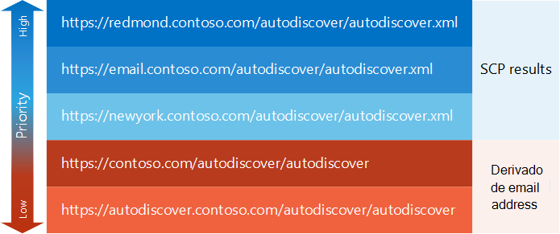

# Gerar uma lista de pontos de extremidade de Descoberta Automática

Descubra como gerar uma lista priorizada de pontos de extremidade de descoberta automática.
  
A primeira tarefa no [processo de descoberta automática](autodiscover-for-exchange.md) é para gerar uma lista de pontos de extremidade de descoberta automática para que seu aplicativo tente. Esses pontos de extremidade de descoberta automática podem ser provenientes de uma [pesquisa de SCP](how-to-find-autodiscover-endpoints-by-using-scp-lookup-in-exchange.md) ou podem ser derivados do endereço de email do usuário. No final, você pode acabar com um grande número de pontos de extremidade. Vamos dar uma olhada em como você pode organizá-las por prioridade. 
  
## Iniciar com pesquisa de SCP

Os pontos de extremidade de descoberta automática provenientes de uma [pesquisa de SCP](how-to-find-autodiscover-endpoints-by-using-scp-lookup-in-exchange.md) devem ter prioridade máxima na sua lista. Os administradores podem configurar os objetos SCP para encaminhar seu cliente para o ponto de extremidade de descoberta automática mais próximo ou mais eficiente, portanto, é uma boa ideia começar com esses pontos de extremidade. Como o processo de pesquisa do SCP tem seu próprio esquema de priorização, os resultados de uma pesquisa de SCP já são priorizados, da seguinte maneira: 
  
1. Pontos de extremidade de descoberta automática de objetos SCP com escopo para o site do Active Directory ao qual o computador cliente pertence.
    
2. Pontos de extremidade de descoberta automática de objetos SCP sem escopo para qualquer site do Active Directory.
    
3. Pontos de extremidade de descoberta automática de objetos SCP com escopo para um site do Active Directory diferente do local ao qual pertence o computador cliente.
    
Após ter os resultados do processo de pesquisa do SCP, você pode adicionar pontos de extremidade que derivem do endereço de email do usuário. Eles podem servir como um conjunto padrão de pontos de extremidade e um fallback no caso de não haver nenhum resultado de SCP ou os pontos de extremidade retornados da pesquisa de SCP não são suficientes.
  
## Adicionar pontos de extremidade derivados do endereço de email do usuário

Quando a pesquisa de SCP não funciona, ou os pontos de extremidade retornados pela pesquisa de SCP não retornam uma resposta bem-sucedida, você pode derivar um conjunto de pontos de extremidade de descoberta automática padrão do endereço de email do usuário. Esses pontos de extremidade devem ser uma prioridade mais baixa do que qualquer um que vier de uma pesquisa de SCP, mas você pode precisar deles se a pesquisa de SCP não tiver sido bem-sucedida.
  
### Para derivar pontos de extremidade de descoberta automática

1. Extraia o nome de domínio do endereço de email do usuário. Por exemplo, se o endereço de email do usuário for Sadie.Daniels@contoso.com, o nome de domínio será contoso.com.
    
2. Construa URLs de ponto de extremidade sem extensões de arquivo nos seguintes formatos:
    
  - "https://" + domínio + "/autodiscover/autodiscover"
    
  - "https://autodiscover." + Domain + "/autodiscover/autodiscover"
    
Depois de compilar a lista de URLs de pontos de extremidade que derivam de pesquisa de SCP e do endereço de email do usuário, talvez seja necessário revisar as extensões de nome de arquivo nessas URLs, dependendo se você está usando o [serviço Web de descoberta automática SOAP](https://msdn.microsoft.com/library/61c21ea9-7fea-4f56-8ada-bf80e1e6b074%28Office.15%29.aspx) ou o [serviço Web de descoberta automática do Pox](https://msdn.microsoft.com/library/877152f0-f4b1-4f63-b2ce-924f4bdf2d20%28Office.15%29.aspx).
  
## Adicionar ou substituir extensões de nome de arquivo nas URLs de ponto de extremidade

Você pode acessar o serviço de descoberta automática usando o serviço Web de descoberta automática do SOAP ou o serviço Web de descoberta automática do POX. Cada serviço usa URLs de ponto de extremidade semelhantes, com a única diferença que é a extensão de nome de arquivo. O serviço Web de descoberta automática do SOAP usa a extensão de nome de arquivo ". svc" e o serviço Web de descoberta automática do POX usa a extensão de nome de arquivo ". xml".
  
Por padrão, as URLs de ponto de extremidade de descoberta automática retornadas de uma pesquisa de SCP são URLs de POX. No entanto, se você estiver usando a descoberta automática SOAP, basta alterar a extensão de nome de arquivo de ". xml" para ". svc" e tentar uma solicitação SOAP.
  
Para as URLs de ponto de extremidade de descoberta automática derivadas, a extensão do arquivo é omitida. Adicione a extensão de arquivo apropriada para o serviço Web de descoberta automática que você está usando antes de tentar a URL.
  
## Exemplo: gerando uma lista de pontos de extremidade de descoberta automática

Vamos dar uma olhada em um exemplo. Sadie Daniels (Sadie.Daniels@contoso.com) está usando um aplicativo de serviços Web do Exchange (EWS) pela primeira vez. O aplicativo usa a descoberta automática para se configurar. O computador do Sadie está associado ao domínio contoso.com e está no site do Active Directory em Redmond. O aplicativo gera a lista de pontos de extremidade de descoberta automática mostrados na Figura 1.
  
**Figura 1: lista de exemplos de pontos de extremidade de descoberta automática**

  
O aplicativo EWS neste exemplo prefere o serviço Web de descoberta automática do SOAP, de forma que ele altere a extensão de nome de arquivo para os resultados do SCP para ". svc" antes de enviar solicitações SOAP a eles.
  
## Próximas etapas

Depois de gerar uma lista de pontos de extremidade de descoberta automática, experimente-os [enviando solicitações para esses pontos de extremidade](how-to-get-user-settings-from-exchange-by-using-autodiscover.md).
  
## Confira também

- [Descoberta Automática do Exchange](autodiscover-for-exchange.md)
    
- [Localizar os pontos de extremidade de Descoberta Automática usando pesquisa do SCP no Exchange](how-to-find-autodiscover-endpoints-by-using-scp-lookup-in-exchange.md)
    
- [Manipulação de mensagens de erro de Descoberta Automática](handling-autodiscover-error-messages.md)
    

