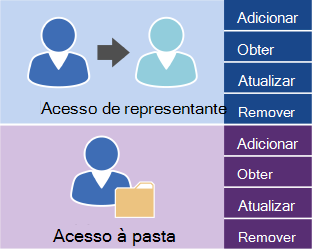

# Gerenciando o acesso de usuário usando o EWS no ExchangeManaging user access by using EWS in Exchange

Descubra quais são as opções de gerenciamento de acesso da conta de usuário ao seu servidor Exchange.Find out what your options are for managing user account access to your Exchange server.
  
API gerenciada de serviços Web do Exchange (EWS) e o EWS fornecem um número limitado de operações que você pode usar para gerenciar contas no Exchange Online, Exchange Online como parte do Office 365 ou uma versão do Exchange, começando com o Exchange 2013.Exchange Web Services (EWS) and the EWS managed API provide a limited number of operations that you can use to manage accounts on Exchange Online, Exchange Online as part of Office 365, or a version of Exchange starting with Exchange 2013. Você pode usar as operações mostradas na figura a seguir para gerenciar representantes e definir permissões de acesso de pasta para as outras contas.You can use the operations shown in the following figure to manage delegates and to set folder access permissions for other accounts. 
  
**Operações do EWS para acesso de representante e pasta****EWS operations for delegate and folder access**

  
Se seu aplicativo precisa controle adicional sobre as contas em um servidor Exchange, você pode usar os cmdlets do Shell de gerenciamento do Exchange para gerenciar as contas.If your application needs additional control over the accounts on an Exchange server, you can use Exchange Management Shell cmdlets to manage the accounts. Você pode chamar os cmdlets do Shell de gerenciamento do Exchange, seguindo um destes procedimentos:You can call the Exchange Management Shell cmdlets by doing one of the following:
  
- Escrever um aplicativo usando c# ou Visual Basic que chama os cmdlets do Shell de gerenciamento do Exchange.Writing an application using C# or Visual Basic that calls the Exchange Management Shell cmdlets. Você pode examinar o código de exemplo na [documentação de API de Shell de gerenciamento do Exchange](../management/exchange-management-shell.md) para saber como chamar um cmdlet.You can look at the sample code in the [Exchange Management Shell API documentation](../management/exchange-management-shell.md) to learn how to call a cmdlet. 
    
- Usando o Windows PowerShell e scripts do Windows PowerShell para chamar os cmdlets do Shell de gerenciamento do Exchange.Using Windows PowerShell and Windows PowerShell scripts to call Exchange Management Shell cmdlets. Você pode encontrar uma lista completa do [Exchange Server PowerShell (Shell de gerenciamento do Exchange)](https://docs.microsoft.com/pt-br/powershell/exchange/exchange-server/exchange-management-shell?view=exchange-ps), juntamente com exemplos que mostram como usá-los.You can find a complete list of the [Exchange Server PowerShell (Exchange Management Shell)](https://docs.microsoft.com/pt-br/powershell/exchange/exchange-server/exchange-management-shell?view=exchange-ps), along with examples that show how to use them. 
    
## Confira tambémSee also

- [Configurando seu aplicativo de EWSSetting up your EWS application](setting-up-your-ews-application.md)   
- [Cmdlets do Exchange 2013Exchange 2013 Cmdlets](https://docs.microsoft.com/pt-br/powershell/exchange/?view=exchange-ps)  
    

