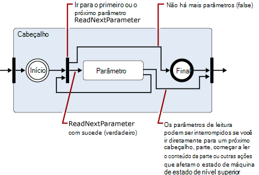
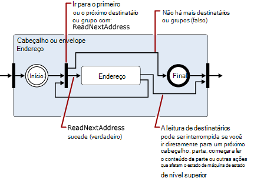
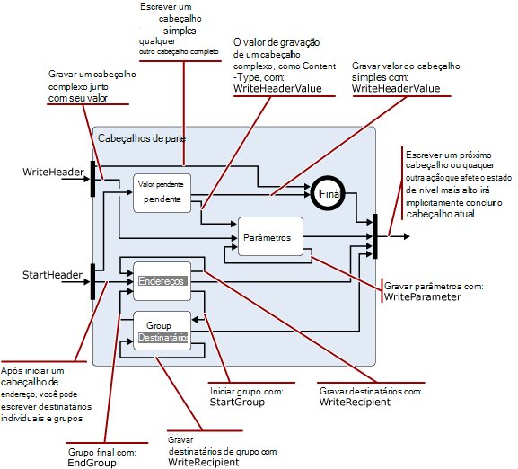

# Leitura e modificação de mensagens no pipeline de transporte do Exchange 2013

Saiba mais sobre as classes do .NET Framework que você pode usar em seus agentes de transporte do Exchange 2013 para ler, gravar e modificar mensagens.
  
**Aplica-se a:** Exchange Server 2013
  
- Classes usadas para ler, gravar ou modificar mensagens
- Namespace de codificadores
- namespace do iCalendar
- Namespace MIME
- Namespace TextConverters
- Namespace TNEF
- namespace vCard
  
Conforme as mensagens passam pelo pipeline de transporte, seu agente de transporte pode ler, gravar e converter o conteúdo de mensagens entre diferentes formatos de dados. Por exemplo, você pode ler e gravar dados MIME, identificar mensagens de entrada que estão no formato UUEncoded ou quoted-imprimível (QP) e, em seguida, convertê-las em um padrão usado pela sua organização ou ler e salvar as informações de calendário ou de contato associadas a mensagens de entrada. 
  
Você também pode identificar o conteúdo que representa uma ameaça de segurança e mover ou excluir o conteúdo ou as mensagens que os contêm; por exemplo, removendo links em uma mensagem HTML.
  
Este artigo fornece informações sobre as classes do .NET Framework que você pode usar para ler, gravar e modificar mensagens.
  
> [!CAUTION]
> Muitas das propriedades e dos parâmetros nas APIs de conversão de conteúdo permitem que os valores sejam grandes o suficiente para causar problemas de desempenho, incluindo a negação de serviço. Ao usar as APIs de conversão de conteúdo em um agente de transporte, você deve implementar limites nos tamanhos de propriedade e de valor de parâmetro que você dá suporte ao ler ou escrever para limitar o consumo de recursos pelo seu agente. 

## Classes usadas para ler, gravar ou modificar mensagens

A tabela a seguir lista as classes do .NET Framework que você pode usar para ler, gravar e modificar mensagens de email.
  
**Namespaces de processamento de mensagens do .NET Framework**

|**Namespace do .NET Framework**|**Aulas**|
|:-----|:-----|
|[Microsoft. Exchange. Data. MIME. decodificadores](https://msdn.microsoft.com/library/Microsoft.Exchange.Data.Mime.Encoders.aspx)   |Contém classes para codificação e decodificação na memória, uma classe de fluxo de codificador que aceita uma das classes de codificador ou decodificador contidas em uma Enumeração associada e a classe de base [ByteEncoder](https://msdn.microsoft.com/library/Microsoft.Exchange.Data.Mime.Encoders.ByteEncoder.aspx) e a classe de exceção [ByteEncoderException](https://msdn.microsoft.com/library/Microsoft.Exchange.Data.Mime.Encoders.ByteEncoderException.aspx) para os codificadores e decodificadores.    |
|[Microsoft. Exchange. Data. ContentTypes. iCalendar](https://msdn.microsoft.com/library/Microsoft.Exchange.Data.ContentTypes.iCalendar.aspx)   |Contém tipos que permitem que você leia e grave fluxos de dados que contenham informações do calendário. Inclui um leitor de calendário e um escritor, um objeto Exception, um objeto Recurrence e estruturas e enumerações que ajudam você a retornar informações de propriedade sobre itens de calendário.    |
|[Microsoft. Exchange. Data. MIME](https://msdn.microsoft.com/library/Microsoft.Exchange.Data.Mime.aspx)   |Contém classes, estruturas, enumerações e representantes que você pode usar para criar, ler, gravar, percorrer, codificar e decodificar dados MIME. Inclui um leitor e um gravador baseados em fluxo que lhe dão acesso somente leitura e gravação para fluxos de dados MIME, bem como métodos e classes baseados em DOM que você pode usar em documentos MIME.    |
|[Conversores Microsoft. Exchange. Data.](https://msdn.microsoft.com/library/Microsoft.Exchange.Data.TextConverters.aspx)   |Contém classes, estruturas, enumerações e representantes que permitem que você leia e grave um fluxo de dados e execute conversões entre tipos de dados específicos; por exemplo, HTML como Rich Text Format (RTF). Os conversores de texto permitem que você altere o formato de um fluxo de documento de um formulário para outro, bem como remova seletivamente elementos de um documento que podem representar um risco de segurança.    |
|[Microsoft. Exchange. Data. ContentTypes. TNEF](https://msdn.microsoft.com/library/Microsoft.Exchange.Data.ContentTypes.Tnef.aspx)   |Contém um leitor e um gravador de fluxo somente de encaminhamento, uma classe de exceção e estruturas e enumerações que facilitam a leitura e a gravação de dados de formato de encapsulamento (TNEF) de transporte neutro.    |
|[Microsoft. Exchange. Data. ContentTypes. vCard](https://msdn.microsoft.com/library/Microsoft.Exchange.Data.ContentTypes.vCard.aspx)   |Contém um leitor e um gravador de fluxo somente de encaminhamento, uma classe de exceção e estruturas e enumerações que facilitam a leitura e a gravação de dados de contatos formatados por vCard.    |
   
## Namespace de codificadores

O namespace de codificadores contém classes para codificação e decodificação na memória. Eles herdam da classe base [ByteEncoder](https://msdn.microsoft.com/library/Microsoft.Exchange.Data.Mime.Encoders.ByteEncoder.aspx) . Classes codificam e decodificadas para Base64, BinHex, quot-imprimível (QP) e UNIX para UNIX (UU). As seguintes classes são usadas para codificação e decodificação na memória: 
  
- [Base64Encoder](https://msdn.microsoft.com/library/Microsoft.Exchange.Data.Mime.Encoders.Base64Encoder.aspx)
    
- [Base64Decoder](https://msdn.microsoft.com/library/Microsoft.Exchange.Data.Mime.Encoders.Base64Decoder.aspx)
    
- [BinHexEncoder](https://msdn.microsoft.com/library/Microsoft.Exchange.Data.Mime.Encoders.BinHexEncoder.aspx)
    
- [BinHexDecoder](https://msdn.microsoft.com/library/Microsoft.Exchange.Data.Mime.Encoders.BinHexDecoder.aspx)
    
- [QPEncoder](https://msdn.microsoft.com/library/Microsoft.Exchange.Data.Mime.Encoders.QPEncoder.aspx)
    
- [QPDecoder](https://msdn.microsoft.com/library/Microsoft.Exchange.Data.Mime.Encoders.QPDecoder.aspx)
    
- [UUEncoder](https://msdn.microsoft.com/library/Microsoft.Exchange.Data.Mime.Encoders.UUEncoder.aspx)
    
- [UUDecoder](https://msdn.microsoft.com/library/Microsoft.Exchange.Data.Mime.Encoders.UUDecoder.aspx)
    
Os codificadores e decodificadores herdam da classe base [ByteEncoder](https://msdn.microsoft.com/library/Microsoft.Exchange.Data.Mime.Encoders.ByteEncoder.aspx) e usam a classe de exceção [ByteEncoderException](https://msdn.microsoft.com/library/Microsoft.Exchange.Data.Mime.Encoders.ByteEncoderException.aspx) para tratamento de erros. 
  
Além disso, o namespace contém a classe [MacBinaryHeader](https://msdn.microsoft.com/library/Microsoft.Exchange.Data.Mime.Encoders.MacBinaryHeader.aspx) , que identifica arquivos codificados MacBinary e lê o cabeçalho de arquivo associado. 
  
Por fim, a classe [EncoderStream](https://msdn.microsoft.com/library/Microsoft.Exchange.Data.Mime.Encoders.EncoderStream.aspx) realiza uma conversão em um fluxo de dados em vez de um objeto na memória. Essa classe aceita uma das classes de codificador ou decodificador e lê ou grava de acordo com a enumeração [EncoderStreamAccess](https://msdn.microsoft.com/library/Microsoft.Exchange.Data.Mime.Encoders.EncoderStreamAccess.aspx) associada. 
  
## namespace do iCalendar

O namespace iCalendar fornece um leitor e gravador somente de encaminhamento para dados do iCalendar, além de estruturas de suporte e classes para criar, acessar e modificar os fluxos do iCalendar.
  
As classes [CalendarReader](https://msdn.microsoft.com/library/Microsoft.Exchange.Data.ContentTypes.iCalendar.CalendarReader.aspx) e [CalendarWriter](https://msdn.microsoft.com/library/Microsoft.Exchange.Data.ContentTypes.iCalendar.CalendarWriter.aspx) são usadas para ler e gravar dados de fluxo do iCalendar. 
  
O CalendarReader usa um [Stream](https://msdn.microsoft.com/library/System.IO.Stream.aspx) legível como um argumento para seus construtores. Você pode usar os métodos [ReadFirstChildComponent](https://msdn.microsoft.com/library/Microsoft.Exchange.Data.ContentTypes.iCalendar.CalendarReader.ReadFirstChildComponent.aspx), [ReadNextSiblingComponent](https://msdn.microsoft.com/library/Microsoft.Exchange.Data.ContentTypes.iCalendar.CalendarReader.ReadNextSiblingComponent.aspx)e [ReadNextComponent](https://msdn.microsoft.com/library/Microsoft.Exchange.Data.ContentTypes.iCalendar.CalendarReader.ReadNextComponent.aspx) para acessar seqüencialmente os componentes do iCalendar no fluxo de dados. Com base no valor definido para a propriedade [compliancemode](https://msdn.microsoft.com/library/Microsoft.Exchange.Data.ContentTypes.iCalendar.CalendarReader.ComplianceMode.aspx) , os erros no fluxo iCalendar causarão uma exceção a ser lançada ou farão com que a propriedade [ComplianceStatus](https://msdn.microsoft.com/library/Microsoft.Exchange.Data.ContentTypes.iCalendar.CalendarReader.ComplianceStatus.aspx) seja definida para um valor diferente de [compatível](https://msdn.microsoft.com/library/microsoft.exchange.data.contenttypes.icalendar.calendarcompliancestatus.aspx). Você pode verificar essa propriedade para descobrir qualquer problema com dados do iCalendar de entrada. 
  
A classe [CalendarWriter](https://msdn.microsoft.com/library/Microsoft.Exchange.Data.ContentTypes.iCalendar.CalendarWriter.aspx) usa um [Stream](https://msdn.microsoft.com/library/System.IO.Stream.aspx) gravável como um argumento para seus construtores. 
  
## Namespace MIME

O namespace MIME fornece classes que permitem criar, acessar e modificar documentos MIME. Você pode trabalhar com documentos MIME usando um método baseado em fluxo ou baseado em DOM.
  
### Classe MimeDocument e o DOM do MIME

A classe [MimeDocument](https://msdn.microsoft.com/library/Microsoft.Exchange.Data.Mime.MimeDocument.aspx) permite o acesso do dom a um documento MIME. Use objetos desse tipo quando você tiver a memória disponível para carregar um DOM inteiro e você deve ter acesso aleatório aos cabeçalhos e ao conteúdo da mensagem. 
  
Você carrega os dados em um objeto [MimeDocument](https://msdn.microsoft.com/library/Microsoft.Exchange.Data.Mime.MimeDocument.aspx) usando os métodos [GetLoadStream](https://msdn.microsoft.com/library/Microsoft.Exchange.Data.Mime.MimeDocument.GetLoadStream.aspx) ou [Load](https://msdn.microsoft.com/library/Microsoft.Exchange.Data.Mime.MimeDocument.Load.aspx) . Você pode então percorrer a hierarquia DOM e criar, modificar ou remover dados MIME. Depois de modificar os dados MIME, você pode gravá-los em um Stream usando um dos métodos [WriteTo](https://msdn.microsoft.com/library/Microsoft.Exchange.Data.Mime.MimeNode.WriteTo.aspx) . 
  
A figura a seguir mostra a estrutura dos dados dentro de um objeto [MimeDocument](https://msdn.microsoft.com/library/Microsoft.Exchange.Data.Mime.MimeDocument.aspx) . 
  
**Figura 1. Estrutura de objetos MimeDocument**

  
### Classes MimeReader e MimeWriter e análise MIME baseada em fluxo

As classes [MimeReader](https://msdn.microsoft.com/library/Microsoft.Exchange.Data.Mime.MimeReader.aspx) e [MimeWriter](https://msdn.microsoft.com/library/Microsoft.Exchange.Data.Mime.MimeWriter.aspx) permitem acesso somente encaminhamento a fluxos MIME. Use essas classes quando não precisar alterar os dados MIME que exigem dados que já tenham sido lidos ou gravados. Por exemplo, se você deseja imprimir mensagens que correspondam a um formato predefinido, a classe [MimeWriter](https://msdn.microsoft.com/library/Microsoft.Exchange.Data.Mime.MimeWriter.aspx) pode ser ideal. 
  
A classe [MimeDocument](https://msdn.microsoft.com/library/Microsoft.Exchange.Data.Mime.MimeDocument.aspx) ENCAPSULA um dom. As classes [MimeReader](https://msdn.microsoft.com/library/Microsoft.Exchange.Data.Mime.MimeReader.aspx) e [MimeWriter](https://msdn.microsoft.com/library/Microsoft.Exchange.Data.Mime.MimeWriter.aspx) representam computadores de estado. Seus Estados mudam com base na entrada recebida e os métodos chamados. As figuras 2 a 5 são diagramas de transição de estado simplificados que mostram, para o objeto [MimeReader](https://msdn.microsoft.com/library/Microsoft.Exchange.Data.Mime.MimeReader.aspx) , quais métodos são válidos para chamar de cada Estado e o estado que resultará. 
  
Para usar esses diagramas, siga as setas de um estado para a próxima, observando as chamadas de método ou valores de retorno que fazem com que o estado seja alterado. Por exemplo, no primeiro diagrama, suponha que você está no início do fluxo que pertence ao MimeReader que você criou. Para chegar ao estado de cabeçalhos da parte, chame um de [ReadNextPart](https://msdn.microsoft.com/library/Microsoft.Exchange.Data.Mime.MimeReader.ReadNextPart.aspx) ou [ReadFirstChildPart](https://msdn.microsoft.com/library/Microsoft.Exchange.Data.Mime.MimeReader.ReadFirstChildPart.aspx), nessa ordem. Se houver cabeçalhos (ou seja, se o MIME estiver bem formado), você irá inserir no estado cabeçalhos da parte. Caso contrário, uma exceção será lançada. 
  
**Figura 2. Diagrama de transição de estado simplificado para objetos MimeReader**

  
> [!NOTE]
> As figuras 3, 4 e 5 são expandidas nos Estados mostrados em cada um dos diagramas anteriores. 
  
**Figura 3. Expansão do estado de cabeçalhos de parte da Figura 2**

  
**Figura 4. Expansão do estado do cabeçalho da Figura 3 quando um parâmetro foi encontrado em um cabeçalho**

  
> [!NOTE]
> O estado representado pela figura 5 é recursivo, se um grupo de endereços for encontrado, você poderá usar a propriedade [GroupRecipientReader](https://msdn.microsoft.com/library/Microsoft.Exchange.Data.Mime.MimeAddressReader.GroupRecipientReader.aspx) para ler os endereços no grupo. 
  
**Figura 5. Expansão do estado do cabeçalho da Figura 3 quando um endereço ou grupo de endereços é encontrado**

  
As figuras 6 e 7 mostram os diagramas de transição de estado simplificados para o objeto [MimeWriter](https://msdn.microsoft.com/library/Microsoft.Exchange.Data.Mime.MimeWriter.aspx) . 
  
> [!NOTE]
> A Figura 7 expande o estado de cabeçalhos de parte mostrado na Figura 6. 
  
**Figura 6. Diagrama de transição de estado simplificado para objetos MimeWriter**

  
**Figura 7. Expansão do estado de cabeçalhos de parte da Figura 6**

  
## Namespace TextConverters

O namespace TextConverters contém tipos que dão suporte à conversão do conteúdo de mensagens de email. Esses tipos podem executar conversão de página de código, remover HTML que não é seguro e realizar outras transformações em corpos de mensagens de email. O namespace [Microsoft. Exchange. Data. TextConverters](https://msdn.microsoft.com/library/Microsoft.Exchange.Data.TextConverters.aspx) inclui as seguintes classes que derivam da classe abstrata [textconverter](https://msdn.microsoft.com/library/Microsoft.Exchange.Data.TextConverters.TextConverter.aspx) : 
  
- [EnrichedToHtml](https://msdn.microsoft.com/library/Microsoft.Exchange.Data.TextConverters.EnrichedToHtml.aspx)
    
- [EnrichedToText](https://msdn.microsoft.com/library/Microsoft.Exchange.Data.TextConverters.EnrichedToText.aspx)
    
- [HtmlToEnriched](https://msdn.microsoft.com/library/Microsoft.Exchange.Data.TextConverters.HtmlToEnriched.aspx)
    
- [HtmlToHtml](https://msdn.microsoft.com/library/Microsoft.Exchange.Data.TextConverters.HtmlToHtml.aspx)
    
- [HtmlToRtf](https://msdn.microsoft.com/library/Microsoft.Exchange.Data.TextConverters.HtmlToRtf.aspx)
    
- [HtmlToText](https://msdn.microsoft.com/library/Microsoft.Exchange.Data.TextConverters.HtmlToText.aspx)
    
- [RtfCompressedToRtf](https://msdn.microsoft.com/library/Microsoft.Exchange.Data.TextConverters.RtfCompressedToRtf.aspx)
    
- [RtfToHtml](https://msdn.microsoft.com/library/Microsoft.Exchange.Data.TextConverters.RtfToHtml.aspx)
    
- [RtfToRtf](https://msdn.microsoft.com/library/Microsoft.Exchange.Data.TextConverters.RtfToRtf.aspx)
    
- [RtfToRtfCompressed](https://msdn.microsoft.com/library/Microsoft.Exchange.Data.TextConverters.RtfToRtfCompressed.aspx)
    
- [RtfToText](https://msdn.microsoft.com/library/Microsoft.Exchange.Data.TextConverters.RtfToText.aspx)
    
- [TextToHtml](https://msdn.microsoft.com/library/Microsoft.Exchange.Data.TextConverters.TextToHtml.aspx)
    
- [TextToRtf](https://msdn.microsoft.com/library/Microsoft.Exchange.Data.TextConverters.TextToRtf.aspx)
    
- [TextToText](https://msdn.microsoft.com/library/Microsoft.Exchange.Data.TextConverters.TextToText.aspx)
    
Esses conversores de texto permitem que você altere o formato de um fluxo de documentos ou remova elementos que não sejam seguros de um documento HTML. Essas classes podem ser usadas por si mesmas para executar uma conversão usando uma única chamada para um dos métodos Convert na classe base [textconverter](https://msdn.microsoft.com/library/Microsoft.Exchange.Data.TextConverters.TextConverter.aspx) ou podem ser passadas para um construtor do conversor, que o usa para executar leituras ou gravações convertidas. 
  
A funcionalidade herdada da classe base é útil para a execução de conversões quando você tem espaço suficiente para armazenar o documento original e sua saída convertida, ou quando você deseja armazenar os resultados da conversão. O método **Convert** usa fluxos de entrada e saída, leitores de texto ou gravadores de texto e converte o conteúdo da entrada para a saída associada. 
  
Também estão incluídos no namespace as seguintes classes de leitor, gravador e fluxo de texto:
  
- [ConverterReader](https://msdn.microsoft.com/library/Microsoft.Exchange.Data.TextConverters.ConverterReader.aspx) — derivado de **System. IO. TextReader**. 
    
- [ConverterWriter](https://msdn.microsoft.com/library/Microsoft.Exchange.Data.TextConverters.ConverterWriter.aspx) — derivado de **System. IO. TextWriter**. 
    
- [ConverterStream](https://msdn.microsoft.com/library/Microsoft.Exchange.Data.TextConverters.ConverterStream.aspx) — derivado de **System. IO. Stream**. 
    
Eles são usados para executar conversões quando você não tem espaço para armazenar o original ou sua saída convertida, quando você recebe a entrada de ou envia a saída para um Stream ou quando você deseja a saída somente para fins de indexação ou pesquisa e, portanto, não deseja armazenar o resultado de uma conversão.
  
## Namespace TNEF

O namespace TNEF contém classes e tipos que permitem a leitura e gravação com base em fluxo somente de encaminhamento de dados TNEF. O TNEF é um formato de dados que é usado para encapsular propriedades MAPI para clientes que não podem interpretar o MAPI.
  
As classes [TnefReader](https://msdn.microsoft.com/library/Microsoft.Exchange.Data.ContentTypes.Tnef.TnefReader.aspx) e [TnefWriter](https://msdn.microsoft.com/library/Microsoft.Exchange.Data.ContentTypes.Tnef.TnefWriter.aspx) fornecem a funcionalidade principal no namespace [Microsoft. Exchange. Data. ContentTypes. TNEF](https://msdn.microsoft.com/library/Microsoft.Exchange.Data.ContentTypes.Tnef.aspx) . 
  
A classe [TnefReader](https://msdn.microsoft.com/library/Microsoft.Exchange.Data.ContentTypes.Tnef.TnefReader.aspx) usa um Stream legível como um argumento para seus construtores. Em seguida, use o método [ReadNextAttribute](https://msdn.microsoft.com/library/Microsoft.Exchange.Data.ContentTypes.Tnef.TnefReader.ReadNextAttribute.aspx) para ler de forma sequencial os atributos no fluxo TNEF. Depois de ler um atributo, você pode acessar informações sobre o atributo usando qualquer uma das propriedades somente leitura no objeto [TnefReader](https://msdn.microsoft.com/library/Microsoft.Exchange.Data.ContentTypes.Tnef.TnefReader.aspx) , além de obter um [TnefPropertyReader](https://msdn.microsoft.com/library/Microsoft.Exchange.Data.ContentTypes.Tnef.TnefPropertyReader.aspx) para ler a propriedade atual. Você também pode acessar diretamente o atributo atual usando o método [ReadAttributeRawValue](https://msdn.microsoft.com/library/Microsoft.Exchange.Data.ContentTypes.Tnef.TnefReader.ReadAttributeRawValue.aspx) . 
  
A classe [TnefWriter](https://msdn.microsoft.com/library/Microsoft.Exchange.Data.ContentTypes.Tnef.TnefWriter.aspx) usa um [Stream](https://msdn.microsoft.com/library/System.IO.Stream.aspx) gravável como um argumento para seus construtores. A classe [TnefWriter](https://msdn.microsoft.com/library/Microsoft.Exchange.Data.ContentTypes.Tnef.TnefWriter.aspx) fornece várias maneiras de gravar dados nesse fluxo. 
  
## namespace vCard

O namespace vCard contém classes, estruturas e enumerações usadas para ler e gravar informações de contato contidas em uma mensagem de email que está no formato de dados vCard. O namespace contém um leitor e gravador de contato, uma classe de exceção, um leitor de propriedades, um leitor de parâmetro e enumerações de suporte que permitem que você leia os dados do vCard associados a uma mensagem de email.
  
## Confira também

- [Agentes de transporte no Exchange](transport-agents-in-exchange-2013.md)  
- [Conceitos de agente de transporte no Exchange 2013](transport-agent-concepts-in-exchange-2013.md) 
- [Referência do agente de transporte para o Exchange 2013](transport-agent-reference-for-exchange-2013.md)
- [Tipos de mídia MIME](http://www.iana.org/assignments/media-types)
    

